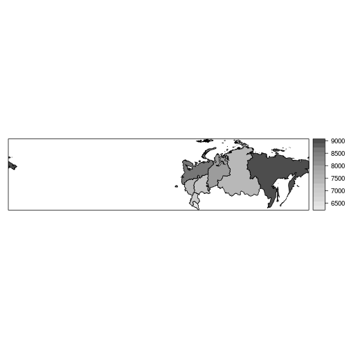
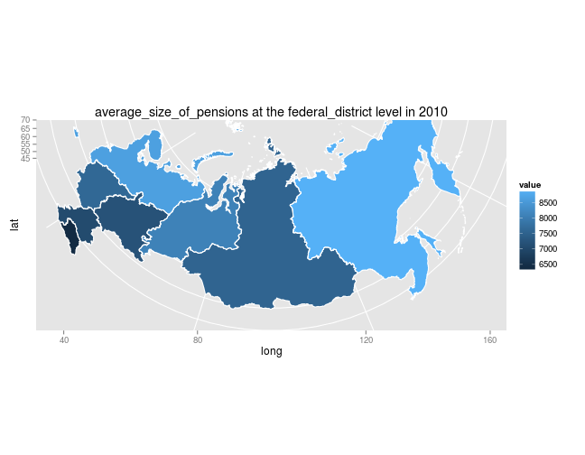

##  Examples: GADM database of Global Administrative Areas


## Introduction

rustfare has functions for downloading a spatial shapefile from [Global Administrative Areas (GADM)](http://www.gadm.org/) database that can be further used to for example plot the data from Rosstat regional data.

Function `GetRusGADM()` downloads the shapefile at desired level. Level argument accepts four values:

- `federal`: whole country
- `federal_districts`: Federal districts (8)
- `region`: administrative boundaries at the level of federal regions/oblasts (82)
- `rayon`: administrative boundaries at the level of rayons/krais


```r
shapefile <- GetRusGADM(level)
```


## Plot shapefiles

### At federal level


```r
library(rustfare)
shapefile <- GetRusGADM("federal")
plot(shapefile)
```

 


### At federal district level


```r
library(rustfare)
shapefile <- GetRusGADM("federal_district")
plot(shapefile)
```

 


### At regional level


```r
library(rustfare)
shapefile <- GetRusGADM("region")
plot(shapefile)
```

 


### At rayon level


```r
library(rustfare)
shapefile <- GetRusGADM("rayon")
plot(shapefile)
```

 


## Combining data from Rosstat Regional Data with GADM shapefile and visualizing it

### Using maptools and sp


```r
library(rustfare)
dat <- GetRosstat("average_size_of_pensions", "federal_district")
dat10 <- subset(dat, year == 2010)
shape <- GetRusGADM("federal_district")
library(maptools)
row.names(dat10) <- dat10$id_shape
row.names(shape) <- as.character(shape$ID_1)
dat10 <- dat10[order(row.names(dat10)), ]
shape <- shape[order(row.names(shape)), ]
df <- spCbind(shape, dat10)
library(sp)
spplot(df, "value", col.regions = grey.colors(20, 0.9, 0.3))
```

 


### Using ggplot2

There is a `RosstatMapPlot`-function in rustfare that takes `measure`, `year` and `level` as arguments.

#### Infant mortality rate at regional level


```r
library(rustfare)
RosstatMapPlot("infant_mortality_rate", 2010, "region")
```

 


#### Average pension size at federal district level


```r
library(rustfare)
RosstatMapPlot("average_size_of_pensions", 2010, "federal_district")
```

 

