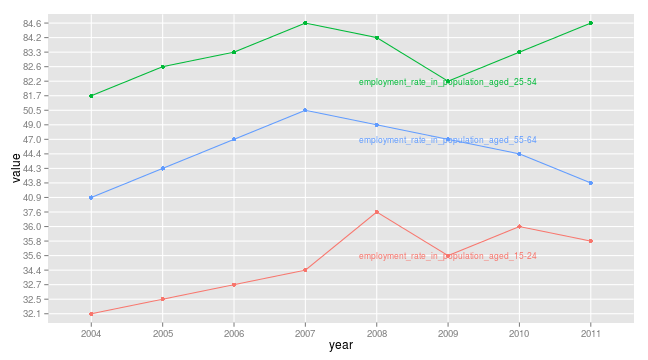

## Examples: OECD Country Statistical Profile: Russia


As Russia is not a member of OECD there is only limited data available in here: [Country statistical profile: Russian Federation](http://www.oecd-ilibrary.org/economics/country-statistical-profile-russian-federation-2013_csp-rus-table-2013-1-en). rustfaRe has function to download indicators from that dataset.

Function `IndicatorOecd()` returns a data.frame with all the indicators listed.


```r
library(rustfaRe)
head(IndicatorOecd())
```

```
##                      levels(df.long$indicator)
## 1                                  aquaculture
## 2 average_time_worked_per_person_in_employment
## 3            co2emissions_from_fuel_combustion
## 4                      crude_oil_import_prices
## 5          current_account_balance_of_payments
## 6                              economic_growth
```

for plotting employment rates of different age classes you can try the following example:


```r
library(rustfaRe)
library(ggplot2)
dat14_24 <- GetOecd("employment_rate_in_population_aged_15-24")
dat25_54 <- GetOecd("employment_rate_in_population_aged_25-54")
dat55_64 <- GetOecd("employment_rate_in_population_aged_55-64")
dat <- rbind(dat14_24, dat25_54, dat55_64)

ggplot(dat, aes(x = year, y = value, color = indicator, group = indicator)) + 
    geom_point() + geom_line() + geom_text(data = subset(dat, year == 2009), 
    aes(x = year, y = value, color = indicator, label = indicator), size = 3) + 
    theme(legend.position = "none")
```

 

