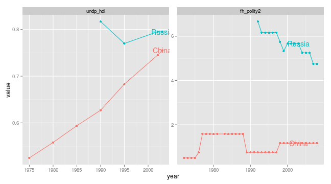

## Examples: Quality of Governance database

- [Link to Quality of Governance institute](http://www.qog.pol.gu.se/)

>The QoG Institute was founded in 2004 by Professor Bo Rothstein and Professor Sören Holmberg. It is an independent research institute within the Department of Political Science at the University of Gothenburg. We conduct and promote research on the causes, consequences and nature of Good Governance and the Quality of Government (QoG) - that is, trustworthy, reliable, impartial, uncorrupted and competent government institutions.

>The main objective of our research is to address the theoretical and empirical problem of how political institutions of high quality can be created and maintained. A second objective is to study the effects of Quality of Government on a number of policy areas, such as health, the environment, social policy, and poverty. We approach these problems from a variety of different theoretical and methodological angles.

rustfare utilises the **QoG Standard Data**. Site with more information and code books: [QoG Standard Data](http://www.qog.pol.gu.se/data/datadownloads/qogstandarddata/)

Below is an example on how to extract data on human development index and Democracy (Freedom
House/Polity) index.


```r
library(rustfare)
dat <- GetQog(country = c("Russia","China"), # country,countries
              indicator=c("undp_hdi","fh_polity2")) # indicator(s)
library(ggplot2)
ggplot(dat, aes(x=year,y=value,color=cname)) + 
  geom_point() + geom_line() +
  geom_text(data = subset(dat, year == 2003), 
            aes(x=year,y=value,color=cname,label=cname)) +
  facet_wrap(~indicator, scales="free") +
  theme(legend.position="none")
```

 

