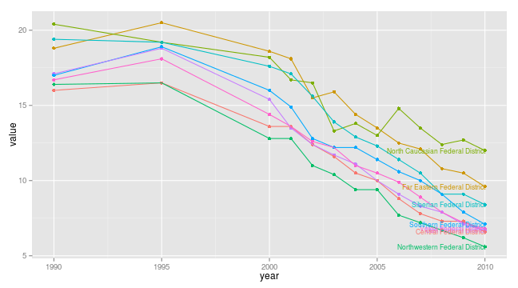

## Examples: Rosstat regional statistics

Function `IndicatorRosstat()` returns a dataset with available indicators and metadata in Russian and English


```r
ind <- IndicatorRosstat()
ind[1:3, 1:3]
```


[Rosstat regional statistic](http://www.gks.ru/wps/wcm/connect/rosstat_main/rosstat/ru/statistics/publications/catalog/doc_1138623506156) includes values of the indicators on three levels:

1. federal level
2. federal district level
3. regional level

To dowload the data you may use `GetRosstat()`-function that requires two arguments, 

1. `indicator` (from the listing above), 
2. `level` (federal/federal_district/region)

The code below returns a dataset at **federal district level** on **infant mortality** and plots a line graph over time.


```r
library(rustfare)  # load rustfare for obtaining the data
library(ggplot2)  # load ggplot2 for plotting
dat <- GetRosstat("infant_mortality_rate", "federal_district")
head(dat, 3)  # print the first 6 rows of data.frame
```

```
##        id_name                               region year value
## 1 дальневокруг Дальневосточный\r\nфедеральный округ 1995  20.5
## 2 дальневокруг Дальневосточный\r\nфедеральный округ 2001  18.1
## 3 дальневокруг Дальневосточный\r\nфедеральный округ 2000  18.6
##                           region_ru                    region_en
## 1 Дальневосточный федеральный округ Far Eastern Federal District
## 2 Дальневосточный федеральный округ Far Eastern Federal District
## 3 Дальневосточный федеральный округ Far Eastern Federal District
##              level id_shape             indicator
## 1 federal_district        4 infant_mortality_rate
## 2 federal_district        4 infant_mortality_rate
## 3 federal_district        4 infant_mortality_rate
```

```r
ggplot(dat, aes(x = year, y = value, color = region_en)) + geom_point() + geom_line() + 
    geom_text(data = subset(dat, year == 2010), aes(x = year, y = value, color = region_en, 
        label = region_en), size = 3, hjust = 1) + theme(legend.position = "none")
```

 

