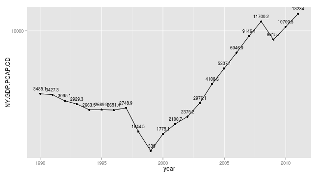

##  Examples: World Bank World Development Indicators


As for [World Bank Development Indicators](http://data.worldbank.org/data-catalog/world-development-indicators) rustfare relies on [WDI-package](http://cran.r-project.org/web/packages/WDI/index.html) for which you can find examples here [github.com/vincentarelbundock/WDI](https://github.com/vincentarelbundock/WDI).

With the following code you can plot GDP per capita (current US$) using log-scale from 1990 to 2011.


```r
library(WDI)
library(ggplot2)
# Search for GDP
head(WDIsearch('gdp'))
```

```
##      indicator          
## [1,] "BG.GSR.NFSV.GD.ZS"
## [2,] "BM.KLT.DINV.GD.ZS"
## [3,] "BN.CAB.XOKA.GD.ZS"
## [4,] "BN.CUR.GDPM.ZS"   
## [5,] "BN.GSR.FCTY.CD.ZS"
## [6,] "BN.KLT.DINV.CD.ZS"
##      name                                                                      
## [1,] "Trade in services (% of GDP)"                                            
## [2,] "Foreign direct investment, net outflows (% of GDP)"                      
## [3,] "Current account balance (% of GDP)"                                      
## [4,] "Current account balance excluding net official capital grants (% of GDP)"
## [5,] "Net income (% of GDP)"                                                   
## [6,] "Foreign direct investment (% of GDP)"
```

```r
# code for it NY.GDP.PCAP.CD
# dowload the data from 1990 to 2011
dat <- WDI(indicator='NY.GDP.PCAP.CD', # indicator
           country='RU', # country/countries
           start=1990, end=2011) # time frame
dat$NY.GDP.PCAP.CD <- round(dat$NY.GDP.PCAP.CD, 1) # round the value to single decimal
ggplot(dat, aes(x=year,y=NY.GDP.PCAP.CD,
                group=country,label=NY.GDP.PCAP.CD)) +
  geom_point() + geom_line() + 
  geom_text(vjust=-1, size=3) +
  scale_y_log10()
```

 

