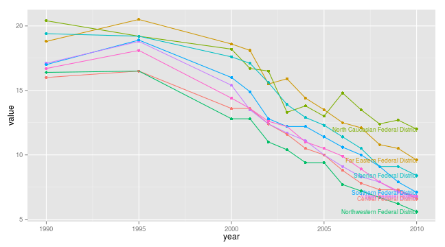
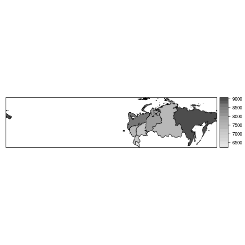
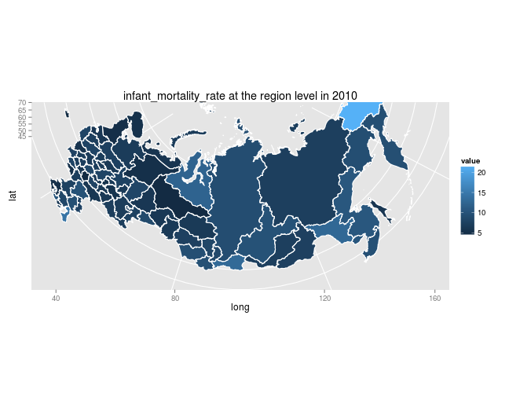
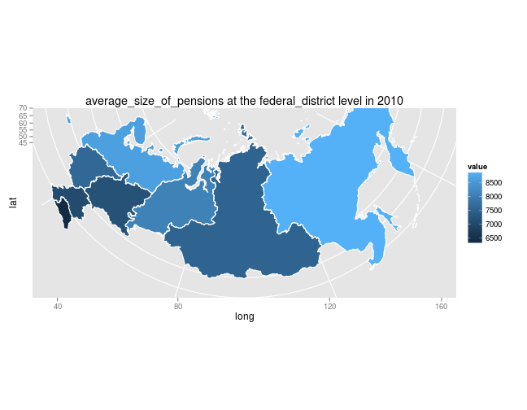
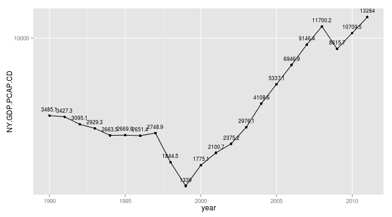

## rustfare-package for R

*toolbox for R language for open welfare data from Russian Federation*

This site has examples on how to use rustfare-package and up-to-date package-documentation, same as delivered with the package itself. Click here for [rustfare on Github](https://github.com/rOpenGov/rustfare).

## rustfare-package

- The rustfare package pools together tools for searching, extracting, and formatting welfare data on Russian Federation from different data providers. 
- The rustfare functions are named according to data provider or the data set. 
- Currently there is data available from: 
    - Rosstat Regional Statistics, 
    - OECD, 
    - Quality of Governance -institute and
    - GADM database of Global Administrative Areas. 
    - World Bank World Development Indicators on Russian Federation can be accessed using [WDI-package](http://cran.r-project.org/web/packages/WDI/index.html) (for examples, see: [markuskainu.fi/r-tutorial/wb/](http://markuskainu.fi/r-tutorial/wb/)

## To-do list (20131115)
- Change the source of Rosstat raw data from [Rosstat Regional statistics](http://www.gks.ru/wps/wcm/connect/rosstat_main/rosstat/ru/statistics/publications/catalog/doc_1138623506156) to [fedstat.ru](http://fedstat.ru/indicators/start.do) and [hub.opengovdata.ru](http://hub.opengovdata.ru/).
- To incorporate [census data from 2002](http://std.gmcrosstata.ru/webapi/opendatabase?id=vpn2002_pert) and [election data from duma election 2011](http://www.vybory.izbirkom.ru/region/region/izbirkom?action=show&root=1&tvd=100100028713304&vrn=100100028713299&region=0&global=1&sub_region=0&prver=0&pronetvd=null&vibid=100100028713304&type=233) with the package

## Installation


```r
library(devtools)
install_github(repo = "rustfare", username = "rOpenGov")
library(rustfare)
```


## Examples by data source (below on this page)

| Examples | Link to Data | Source Shiny apps |
| -------- | ------------ | ----------------- |
| [Rosstat Regional Statistics](index.html) | [Регионы России. Социально-экономические показатели](http://www.gks.ru/wps/wcm/connect/rosstat_main/rosstat/ru/statistics/publications/catalog/doc_1138623506156) | [rustfare-shiny](http://glimmer.rstudio.com/muuankarski/rustfare/) |
| [Oecd](index.html) | [Country statistical profile: Russian Federation](http://www.oecd-ilibrary.org/economics/country-statistical-profile-russian-federation-2013_csp-rus-table-2013-1-en) | 
| [Spatial operations on GADM data](index.html) | [Global Administrative Areas (GADM)](http://www.gadm.org/) |              

## Documentation by function

Automatically generated from package documentation .Rd files in [https://github.com/muuankarski/rustfare/tree/master/man](https://github.com/muuankarski/rustfare/tree/master/man)


<table width="100%">
<tr><th>Name</th><th>Functionality</th></tr>

<tr><td width="25%"><a href="rustfare.html">rustfare-package</a></td>
<td>rustfare: toolbox for R language for open welfare data from Russian Federation</td></tr>
<tr><td width="25%"><a href="GetOecd.html">GetOecd</a></td>
<td>Download data from OECD Country statistical profile: Russian Federation</td></tr>
<tr><td width="25%"><a href="GetQog.html">GetQog</a></td>
<td>Download data from Quality of Governance data</td></tr>
<tr><td width="25%"><a href="GetRosstat.html">GetRosstat</a></td>
<td>Download data from Rosstat Regional Statistics</td></tr>
<tr><td width="25%"><a href="GetRusGADM.html">GetRusGADM</a></td>
<td>Get Russian map data in GADM format</td></tr>
<tr><td width="25%"><a href="IndicatorOecd.html">IndicatorOecd</a></td>
<td>List the currently available indicators from OECD Country statistical profile</td></tr>
<tr><td width="25%"><a href="IndicatorQog.html">IndicatorQog</a></td>
<td>List the currently available indicators from Quality of Governance database</td></tr>
<tr><td width="25%"><a href="IndicatorRosstat.html">IndicatorRosstat</a></td>
<td>List the currently available indicators from Rosstat Regional Statistics</td></tr>
<tr><td width="25%"><a href="RosstatMapPlot.html">RosstatMapPlot</a></td>
<td>Print map using ggplot2</td></tr>
<tr><td width="25%"><a href="rustfare.html">rustfare</a></td>
<td>rustfare: toolbox for R language for open welfare data from Russian Federation</td></tr>
<tr><td width="25%"><a href="ScrapeData.html">ScrapeData</a></td>
<td>Scrape the raw html-table data</td></tr>
<tr><td width="25%"><a href="ScrapeData_skip1.html">ScrapeData_skip1</a></td>
<td>Scrape the raw html-table data (skipping the 1st row)</td></tr>


</table>


# Examples

## Rosstat regional statistics

Function `IndicatorRosstat()` returns a dataset with available indicators and metadata in Russian and English


```r
ind <- IndicatorRosstat()
ind[1:3, 1:3]
```


[Rosstat regional statistic](http://www.gks.ru/wps/wcm/connect/rosstat_main/rosstat/ru/statistics/publications/catalog/doc_1138623506156) includes values of the indicators on three levels:

1. federal level
2. federal district level
3. regional level

To dowload the data you may use `GetRosstat()`-function that requires two arguments, 

1. `indicator` (from the listing above), 
2. `level` (federal/federal_district/region)

The code below returns a dataset at **federal district level** on **infant mortality** and plots a line graph over time.


```r
library(rustfare)  # load rustfare for obtaining the data
library(ggplot2)  # load ggplot2 for plotting
dat <- GetRosstat("infant_mortality_rate", "federal_district")
head(dat, 3)  # print the first 6 rows of data.frame
```

```
##        id_name                               region year value
## 1 дальневокруг Дальневосточный\r\nфедеральный округ 1995  20.5
## 2 дальневокруг Дальневосточный\r\nфедеральный округ 2001  18.1
## 3 дальневокруг Дальневосточный\r\nфедеральный округ 2000  18.6
##                           region_ru                    region_en
## 1 Дальневосточный федеральный округ Far Eastern Federal District
## 2 Дальневосточный федеральный округ Far Eastern Federal District
## 3 Дальневосточный федеральный округ Far Eastern Federal District
##              level id_shape             indicator
## 1 federal_district        4 infant_mortality_rate
## 2 federal_district        4 infant_mortality_rate
## 3 federal_district        4 infant_mortality_rate
```

```r
ggplot(dat, aes(x = year, y = value, color = region_en)) + geom_point() + geom_line() + 
    geom_text(data = subset(dat, year == 2010), aes(x = year, y = value, color = region_en, 
        label = region_en), size = 3, hjust = 1) + theme(legend.position = "none")
```

 


## GADM database of Global Administrative Areas


### Introduction

rustfare has functions for downloading a spatial shapefile from [Global Administrative Areas (GADM)](http://www.gadm.org/) database that can be further used to for example plot the data from Rosstat regional data.

Function `GetRusGADM()` downloads the shapefile at desired level. Level argument accepts four values:

- `federal`: whole country
- `federal_districts`: Federal districts (8)
- `region`: administrative boundaries at the level of federal regions/oblasts (82)
- `rayon`: administrative boundaries at the level of rayons/krais


```r
shapefile <- GetRusGADM(level)
```


## Plot shapefiles

### At federal level


```r
library(rustfare)
shapefile <- GetRusGADM("federal")
plot(shapefile)
```

 


### At federal district level


```r
library(rustfare)
shapefile <- GetRusGADM("federal_district")
plot(shapefile)
```

 


### At regional level


```r
library(rustfare)
shapefile <- GetRusGADM("region")
plot(shapefile)
```

 


### At rayon level


```r
library(rustfare)
shapefile <- GetRusGADM("rayon")
plot(shapefile)
```

 


## Combining data from Rosstat Regional Data with GADM shapefile and visualizing it

### Using maptools and sp


```r
library(rustfare)
dat <- GetRosstat("average_size_of_pensions", "federal_district")
dat10 <- subset(dat, year == 2010)
shape <- GetRusGADM("federal_district")
library(maptools)
row.names(dat10) <- dat10$id_shape
row.names(shape) <- as.character(shape$ID_1)
dat10 <- dat10[order(row.names(dat10)), ]
shape <- shape[order(row.names(shape)), ]
df <- spCbind(shape, dat10)
library(sp)
spplot(df, "value", col.regions = grey.colors(20, 0.9, 0.3))
```

 


### Using ggplot2

There is a `RosstatMapPlot`-function in rustfare that takes `measure`, `year` and `level` as arguments.

#### Infant mortality rate at regional level


```r
library(rustfare)
RosstatMapPlot("infant_mortality_rate", 2010, "region")
```

 


#### Average pension size at federal district level


```r
library(rustfare)
RosstatMapPlot("average_size_of_pensions", 2010, "federal_district")
```

 


## OECD Country Statistical Profile: Russia


As Russia is not a member of OECD there is only limited data available in here: [Country statistical profile: Russian Federation](http://www.oecd-ilibrary.org/economics/country-statistical-profile-russian-federation-2013_csp-rus-table-2013-1-en). rustfaRe has function to download indicators from that dataset.

Function `IndicatorOecd()` returns a data.frame with all the indicators listed.


```r
library(rustfaRe)
head(IndicatorOecd())
```

for plotting employment rates of different age classes you can try the following example:


```r
library(rustfaRe)
library(ggplot2)
dat14_24 <- GetOecd("employment_rate_in_population_aged_15-24")
dat25_54 <- GetOecd("employment_rate_in_population_aged_25-54")
dat55_64 <- GetOecd("employment_rate_in_population_aged_55-64")
dat <- rbind(dat14_24, dat25_54, dat55_64)

ggplot(dat, aes(x = year, y = value, color = indicator, group = indicator)) + 
    geom_point() + geom_line() + geom_text(data = subset(dat, year == 2009), 
    aes(x = year, y = value, color = indicator, label = indicator), size = 3) + 
    theme(legend.position = "none")
```


## World Bank World Development Indicators


As for [World Bank Development Indicators](http://data.worldbank.org/data-catalog/world-development-indicators) rustfare relies on [WDI-package](http://cran.r-project.org/web/packages/WDI/index.html) for which you can find examples here [github.com/vincentarelbundock/WDI](https://github.com/vincentarelbundock/WDI).

With the following code you can plot GDP per capita (current US$) using log-scale from 1990 to 2011.


```r
library(WDI)
library(ggplot2)
# Search for GDP
head(WDIsearch('gdp'))
```

```
##      indicator          
## [1,] "BG.GSR.NFSV.GD.ZS"
## [2,] "BM.KLT.DINV.GD.ZS"
## [3,] "BN.CAB.XOKA.GD.ZS"
## [4,] "BN.CUR.GDPM.ZS"   
## [5,] "BN.GSR.FCTY.CD.ZS"
## [6,] "BN.KLT.DINV.CD.ZS"
##      name                                                                      
## [1,] "Trade in services (% of GDP)"                                            
## [2,] "Foreign direct investment, net outflows (% of GDP)"                      
## [3,] "Current account balance (% of GDP)"                                      
## [4,] "Current account balance excluding net official capital grants (% of GDP)"
## [5,] "Net income (% of GDP)"                                                   
## [6,] "Foreign direct investment (% of GDP)"
```

```r
# code for it NY.GDP.PCAP.CD
# dowload the data from 1990 to 2011
dat <- WDI(indicator='NY.GDP.PCAP.CD', # indicator
           country='RU', # country/countries
           start=1990, end=2011) # time frame
dat$NY.GDP.PCAP.CD <- round(dat$NY.GDP.PCAP.CD, 1) # round the value to single decimal
ggplot(dat, aes(x=year,y=NY.GDP.PCAP.CD,
                group=country,label=NY.GDP.PCAP.CD)) +
  geom_point() + geom_line() + 
  geom_text(vjust=-1, size=3) +
  scale_y_log10()
```

 


## Quality of Governance database

- [Link to Quality of Governance institute](http://www.qog.pol.gu.se/)

>The QoG Institute was founded in 2004 by Professor Bo Rothstein and Professor Sören Holmberg. It is an independent research institute within the Department of Political Science at the University of Gothenburg. We conduct and promote research on the causes, consequences and nature of Good Governance and the Quality of Government (QoG) - that is, trustworthy, reliable, impartial, uncorrupted and competent government institutions.

>The main objective of our research is to address the theoretical and empirical problem of how political institutions of high quality can be created and maintained. A second objective is to study the effects of Quality of Government on a number of policy areas, such as health, the environment, social policy, and poverty. We approach these problems from a variety of different theoretical and methodological angles.

rustfare utilises the **QoG Standard Data**. Site with more information and code books: [QoG Standard Data](http://www.qog.pol.gu.se/data/datadownloads/qogstandarddata/)

Below is an example on how to extract data on human development index and Democracy (Freedom
House/Polity) index.


```r
library(rustfare)
dat <- GetQog(country = c("Russia","China"), # country,countries
              indicator=c("undp_hdi","fh_polity2")) # indicator(s)
library(ggplot2)
ggplot(dat, aes(x=year,y=value,color=cname)) + 
  geom_point() + geom_line() +
  geom_text(data = subset(dat, year == 2003), 
            aes(x=year,y=value,color=cname,label=cname)) +
  facet_wrap(~indicator, scales="free") +
  theme(legend.position="none")
```

